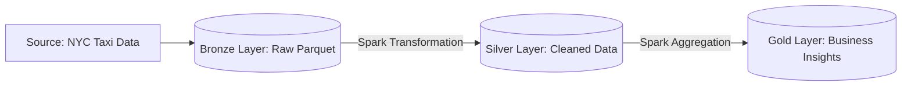

# Big Data Lakehouse avec Apache Spark

Ce projet implémente une **Architecture Médaillon (Bronze/Silver/Gold)** pour traiter des données volumineuses de Taxis New-Yorkais.
Il utilise **Apache Spark** (via PySpark) pour réaliser un ETL distribué capable de scaler sur des téraoctets de données.

## Architecture Médaillon (The Lakehouse)


L'architecture est divisée en 3 couches :

1. Bronze (Raw) : Ingestion brute des fichiers Parquet (Source: NYC TLC).

2. Silver (Curated) : Nettoyage, typage, filtrage des données aberrantes (prix négatifs, passagers nuls).

3. Gold (Business) : Agrégations métiers prêtes pour l'analyse (Top zones de pourboires, Revenus globaux).

## Stack Technique
* Moteur de calcul : Apache Spark 3.x (PySpark)

* Format de stockage : Parquet (Colonnaire, compressé)

* Infrastructure : Docker (Image jupyter/pyspark-notebook)

* Langage : Python 3.9

## Comment l'exécuter

1. Lancer le Cluster Spark (Local) :
```Bash
docker-compose up -d
```
2. Ingérer les données (Download) :
```Bash
python download_data.py
```

3. Lancer le Job ETL (Submit) : Le script est soumis au master Spark à l'intérieur du conteneur Docker.

```Bash
docker exec spark_master spark-submit /home/jovyan/src/etl_job.py
```

4. Monitoring : Accéder à la Spark UI sur http://localhost:4040 pour visualiser les DAGs et les tâches.